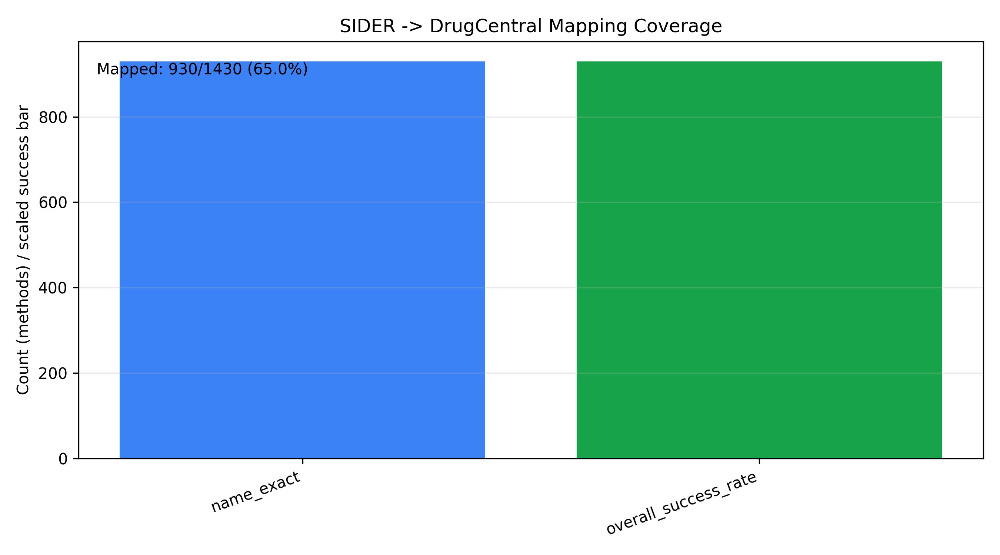

# Week 3 Data Integration Summary

## ID Mapping Coverage

- Total SIDER drugs: 1430
- Mapped to DrugCentral: 930
- Overall success rate: 0.650

| mapping_method | n_drugs |
|---|---:|
| name_exact | 930 |
| unmapped | 500 |

## Top ADR Labels

- Requested K: 10
- Chosen K: 10
- Minimum positives per ADR: 30

| adr_id | adr_term | positives | prevalence | chosen_k |
|---|---|---:|---:|---:|
| C0027497 | Nausea | 790 | 0.8827 | 10 |
| C0018681 | Headache | 752 | 0.8402 | 10 |
| C0011603 | Dermatitis | 723 | 0.8078 | 10 |
| C0015230 | Rash | 717 | 0.8011 | 10 |
| C0042963 | Vomiting | 716 | 0.8000 | 10 |
| C0012833 | Dizziness | 710 | 0.7933 | 10 |
| C0011991 | Diarrhoea | 655 | 0.7318 | 10 |
| C0033774 | Pruritus | 643 | 0.7184 | 10 |
| C0004093 | Asthenia | 640 | 0.7151 | 10 |
| C0020517 | Hypersensitivity | 591 | 0.6603 | 10 |
